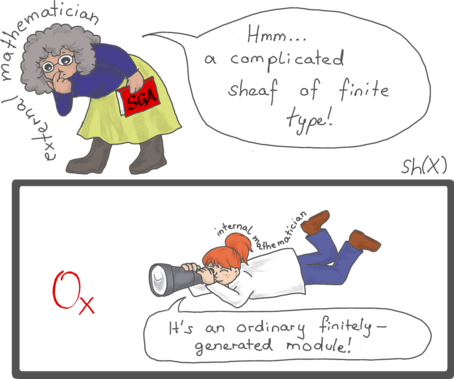

# Using the internal language of toposes in algebraic geometry

There are several important toposes associated to a scheme, for instance the
petit and gros Zariski toposes. These support an internal mathematical language
which closely resembles the usual formal language of mathematics, but is
"local on the base scheme": For example, from the internal perspective, the
structure sheaf looks like an ordinary local ring (instead of a sheaf of rings
with local stalks) and vector bundles look like ordinary free modules (instead
of sheaves of modules satisfying a certain condition). The translation of
internal statements and proofs is facilitated by an easy mechanical procedure.

These expository notes give an introduction to this topic and show how the
internal point of view can be exploited to give simpler definitions and more
conceptual proofs of the basic notions and observations in algebraic geometry.
We also employ this framework to study the phenomenon that some properties
spread from points to open neighbourhoods. We give a general sufficient
condition for this spreading to occur, depending only on the logical form of
the property in question.

No prior knowledge about topos theory or formal logic is assumed.

* [Notes (PDF)](https://github.com/iblech/internal-methods/raw/master/notes.pdf)
* [Poster (PDF)](https://github.com/iblech/internal-methods/raw/master/poster.pdf)
  for GAeL 2014
* [Slides (PDF)](http://www.speicherleck.de/iblech/stuff/gael2013-topos.pdf)
  for GAeL 2013
* [Slides (PDF)](https://github.com/iblech/internal-methods/raw/master/slides-ihes2015.pdf)
  for Topos à l'IHES 2015

